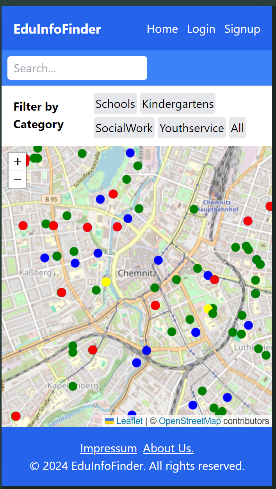
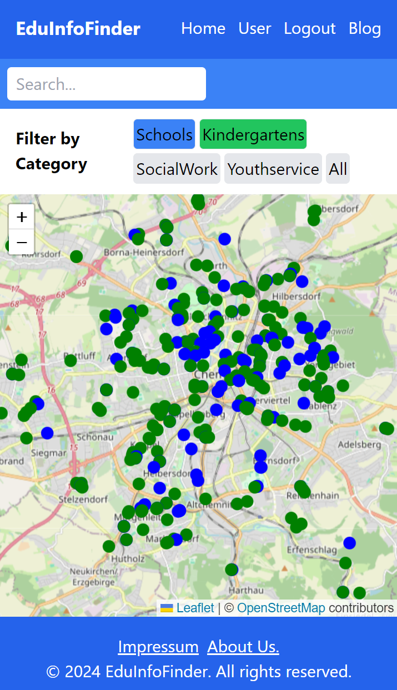
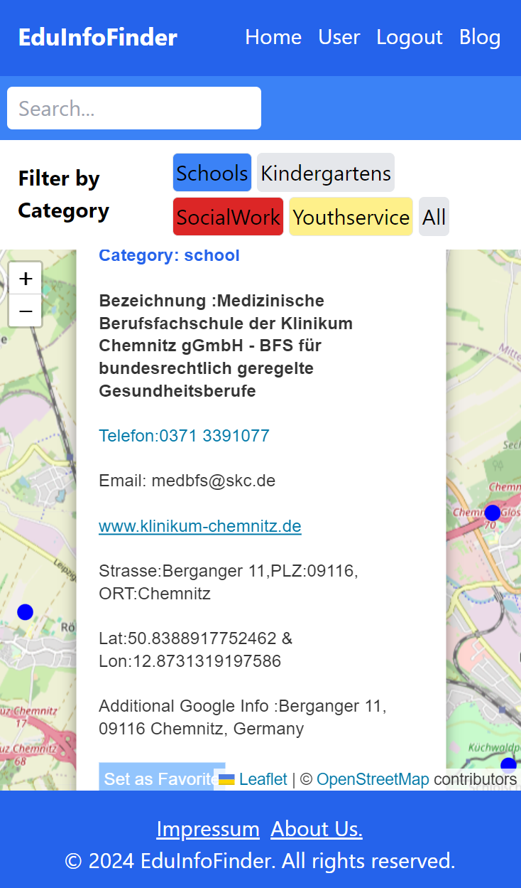

# EduInfoFinder

**Find schools, kindergartens, and social services near you — on an interactive map.**

    

## Overview

EduInfoFinder is a full-stack web app that puts educational and social facilities on an interactive map. Pick a category, click a pin, and instantly see the facility's name, address, phone number, email, and website — without leaving the page.

The data covers four service types — schools, kindergartens, social work centres, and youth services — pulled from ArcGIS public feeds and stored in MongoDB.

## Screenshots

| Home Page | Map View | Facility Popup |
|-----------|----------|----------------|
|  |  |  |

## Features

- Interactive map powered by Leaflet.js with OpenStreetMap tiles
- Filter by category — Schools, Kindergartens, Social Work, Youth Services, or All
- Search facilities by name
- Color-coded markers for each category
- Popups with name, address, phone, email, and website link
- Geolocation support — map centers on your current position
- User accounts — register and log in to save personal data
- Set a favorite facility or save your home address from any marker popup

## Tech Stack

| Layer | Technology |
|-------|-----------|
| Frontend | React 18 + Vite |
| Styling | Tailwind CSS 3 |
| Map | react-leaflet / Leaflet.js |
| Routing | react-router-dom v6 |
| HTTP client | Axios |
| Auth | Firebase |
| Backend | Node.js + Express 4 |
| Database | MongoDB + Mongoose |
| Data source | ArcGIS GeoJSON REST APIs |

## Installation

Prerequisites: **Node.js ≥ 18** and **MongoDB** running locally (or a MongoDB Atlas URI).

**1. Clone the repo**

```bash
git clone https://github.com/rakibul56/Map-Interactive-Web-App.git
cd Map-Interactive-Web-App
```

**2. Set up the database**

Create a MongoDB database named `edudb`, then add your connection string in two places:

`Server/.env`
```env
MONGODB_URI=mongodb://localhost:27017/edudb
```

`Server/Data_fetch/dbtest.js` — find the comment `"Connect To MongoDb"` and paste the same string there.

Then seed the database:

```bash
cd Server
npm install
node Data_fetch/dbtest.js
```

This pulls all four GeoJSON datasets from ArcGIS and saves them to the `features` collection.

**3. Start the server**

```bash
node server.js
# runs on http://localhost:3001
```

**4. Start the client**

```bash
cd ../Client
npm install
npm run dev
# runs on http://localhost:5173
```

## Usage

1. Open `http://localhost:5173` in your browser
2. Sign up — this creates your user record in MongoDB
3. Go to the Map page
4. Use the filter buttons to pick one or more categories
5. Click any marker to see full details for that facility
6. From a popup you can set a favorite or save your home address

## Project Structure

```
Map-Interactive-Web-App/
├── Client/                   # React frontend (Vite)
│   ├── src/
│   │   ├── components/
│   │   │   ├── Map.jsx       # Leaflet map, markers, popups
│   │   │   ├── FilterPanel.jsx
│   │   │   ├── Search.jsx
│   │   │   ├── Header.jsx
│   │   │   └── Footer.jsx
│   │   ├── pages/
│   │   │   ├── Home.jsx
│   │   │   ├── MapPage.jsx   # Owns filter + search state
│   │   │   ├── About.jsx
│   │   │   ├── Login.jsx
│   │   │   └── Signup.jsx
│   │   ├── contexts/         # AuthContext and UserContext
│   │   ├── firebase/         # Firebase config
│   │   └── App.jsx
│   └── package.json
│
└── Server/                   # Express API
    ├── Models/
    │   └── test.model.js     # Feature and User Mongoose models
    ├── Routes/
    │   ├── map_route.js      # GET /api/map?filter=...
    │   ├── user_route.js     # User CRUD
    │   └── test_route.js
    ├── Data_fetch/
    │   ├── dbtest.js         # One-shot data seeder
    │   └── db.js
    ├── server.js             # Entry point, port 3001
    └── package.json
```

## Contributing

Feel free to open issues or submit pull requests. To contribute:

1. Fork the repo
2. Create a branch: `git checkout -b feature/your-feature`
3. Commit your changes and push
4. Open a Pull Request against `main`

## License

MIT License — see [LICENSE](LICENSE) for details.

## Author

**Rakibul Islam**  
[GitHub](https://github.com/rakibul56) · [Email](mailto:rakibulroyal@gmail.com)
